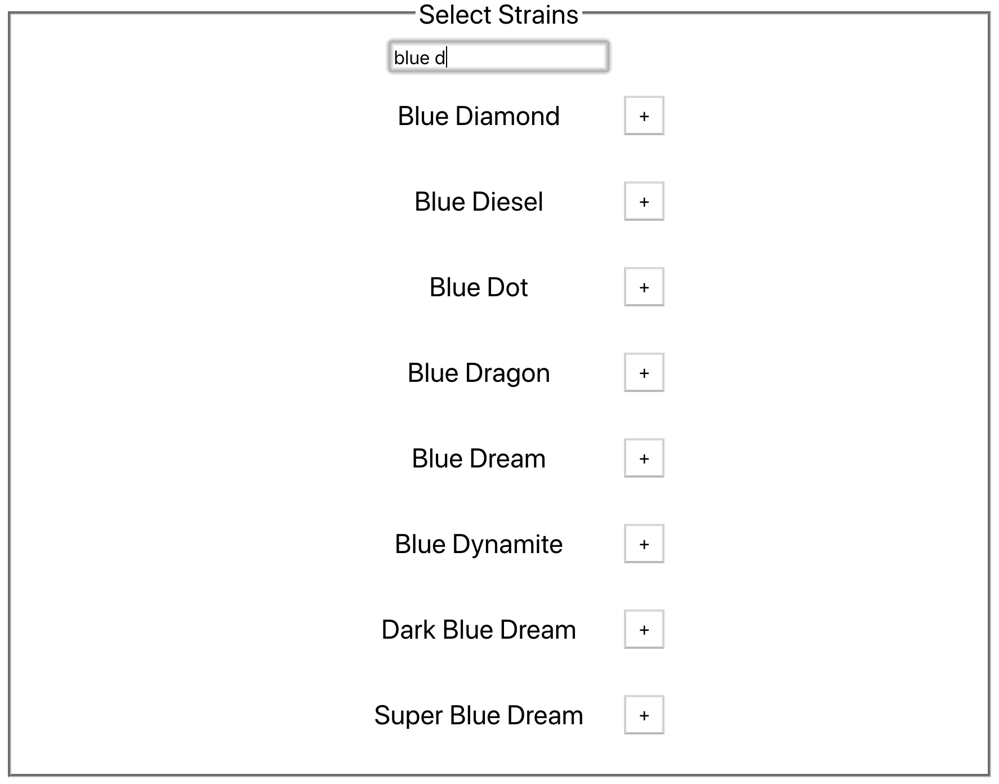

# Strains

## Abstract

This application is built on [Evan Busse's Strain API](http://strains.evanbusse.com/index.html). The goal is to give medical cannabis consumers helpful information regarding strains, species, flavors, and effects of different strains of cannabis.

By selecting a variety of species (sativa, indica, hybrid), effects, and flavors, users can find the most applicable strains for their needs. In addition, users can search over 2,000 strains and find information on each one. Furthermore, users can choose favorites both from the strains menu as well as the search menu.

## Components

1. ```<Nav />```
  Enables navigation between different menus.
2. ```<TypeAhead />```
  Base component for search functions.
3. ```<Strains />```
  Returns list of strains based on ```<TypeAhead />``` input.
4. ```<Effects />```
  Returns list of effects based on ```<TypeAhead />``` input.
5. ```<Species />```
  Returns list of species based on ```<TypeAhead />``` input.
6. ```<Flavors />```
  Returns list of flavors based on ```<TypeAhead />``` input.
7. ```<StrainInfo />```
  Returns a infographic with information regarding the chosen strain.
8. ```<Suggestion />```
  Returns a suggestion based on the species, effects, and flavors chosen.

## Services

1. ```./services/strainservices.js```
  Performs and returns API calls to the Strain API.
2. ```./services/searchservices.js```
  Runs algorithm to return optimal strains to the user.

## Snippets
The purpose of this snippet is to return strains that contain a substring (i.e. searching 'blue d' and returning all valid strains.)



The props passed for this are:
1. ```props.strains``` All possible strains stored in state.
2. ```props.refStrain``` The current string in the input box.
3. ```props.add``` Function to add the chosen strain to state variable ```myStrains```.


```javascript
import React from 'react';

export default function Strains(props) {
  const validStrains = [];
  if (props.refStrain) {
    for (let key in props.strains) {
      if (key.toLowerCase().includes(props.refStrain.toLowerCase())) {
        validStrains.push(key);
      }
    }
  }
  return validStrains.map(strain => {
    return (
      <div key={`${strain}-div`}className="add">
        <p key={strain}>{strain}</p>
        <button type="button" key={`${strain}-button`} onClick={() => props.add(strain)}>+</button>
      </div>
    )
  });
}
```
